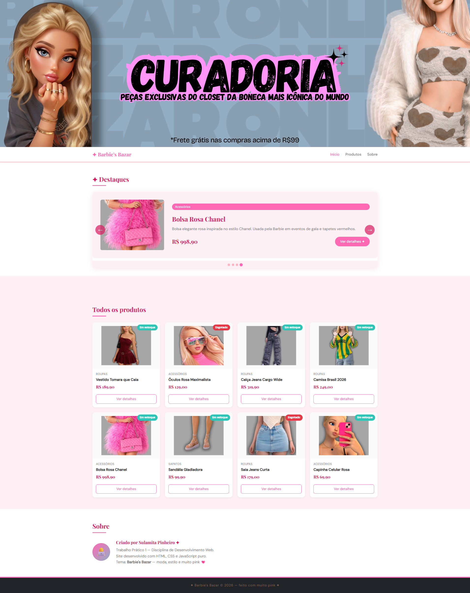
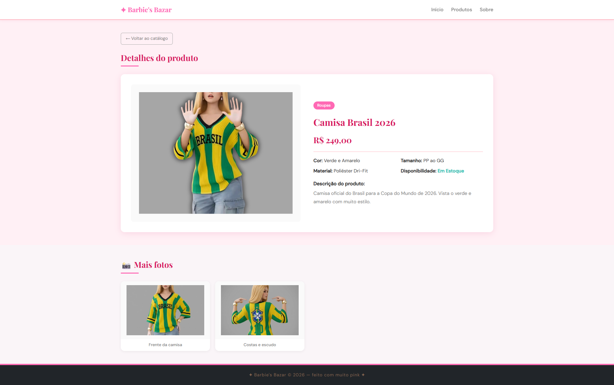

# Trabalho Prático - Semana 11

Nesta atividade, vamos dar continuidade ao projeto desenvolvido ao longo deste semestre, acrescentando a página de detalhes da aplicação.

Imagine que a página principal (home-page) mostre uma visão dos vários itens que existem no seu site. Ao clicar em um item, você é direcionado para a página de detalhes. A página de detalhes vai mostrar todas as informações sobre o item do seu projeto, seja esse item uma notícia, filme, receita, lugar turístico ou evento.

## Informações Gerais

- Nome: Sulamita Pinheiro de Souza
- Matrícula: 927424
- Descreva brevemente seu projeto: O meu projeto consiste em um Bazar online de alguns itens usados pela personagem Barbie durante a sua trajetória profissional. 

## Prints do trabalho

<<  COLOQUE A IMAGEM - HOME-PAGE - AQUI >>

<<  COLOQUE A IMAGEM - TELA DE DETALHES - AQUI >>

## Dados em JSON
Inclua abaixo a estrutura de dados definida para o seu projeto, apresentando pelo menos dois exemplos de registros em formato JSON.

```json
{
    id: 6,
    nome: "Sandália Gladiadora",
    preco: 99.90,
    categoria: "Sapatos",
    cor: "Branco",
    tamanho: "34 ao 40",
    material: "Couro ecológico",
    imagem: "images/sapato.svg",
    descricao: "Sandália gladiadora branca com tiras cruzadas. Perfeita para compor looks confortáveis do dia a dia.",
    emEstoque: true,
    destaque: false,
    fotos: [
      { id: 1, titulo: "Vista frontal", imagem: "images/fronts.jpg" },
      { id: 2, titulo: "Detalhe das tiras", imagem: "images/dtiras.jpg" }
    ]
  },
  {
    id: 7,
    nome: "Saia Jeans Curta",
    preco: 179.00,
    categoria: "Roupas",
    cor: "Azul claro",
    tamanho: "34 ao 42",
    material: "Jeans Strech",
    imagem: "images/saia.svg",
    descricao: "Saia jeans curta levemente desfiada na barra. Combine com cropped e tênis para um look descolado.",
    emEstoque: false,
    destaque: false,
    fotos: [
      { id: 1, titulo: "Vista lateral", imagem: "images/laterals.jpg" },
      { id: 2, titulo: "Detalhe desfiado", imagem: "images/desfiados.jpg" }
    ]
  }
```


